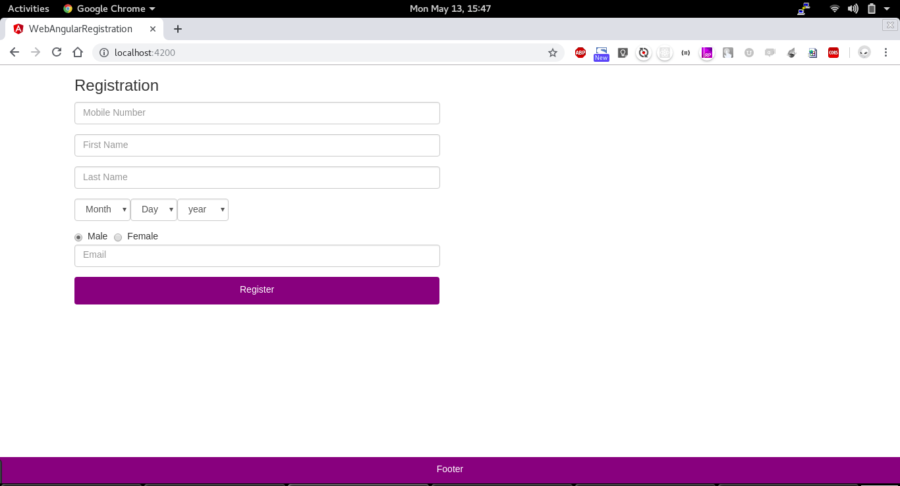
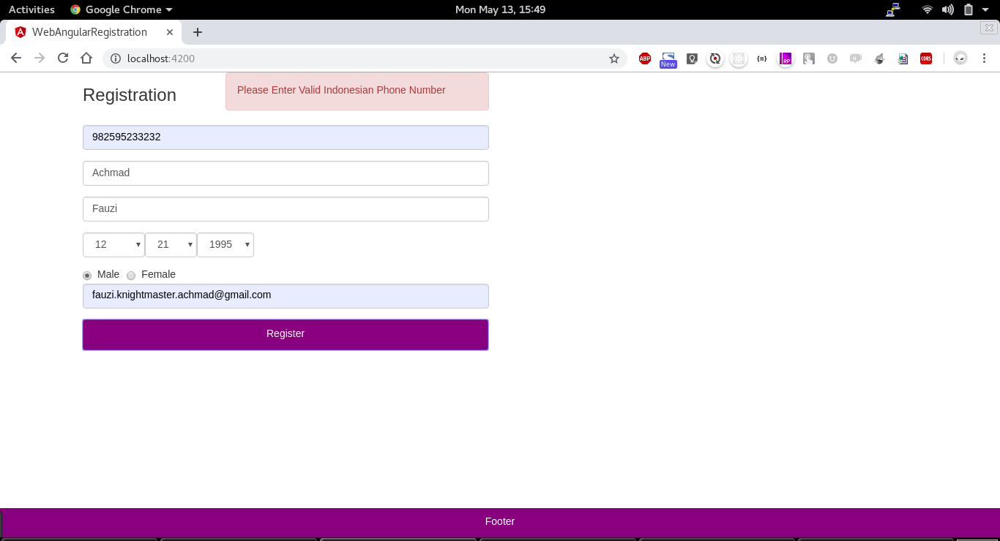
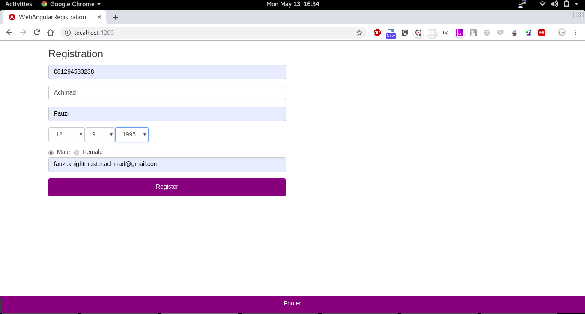
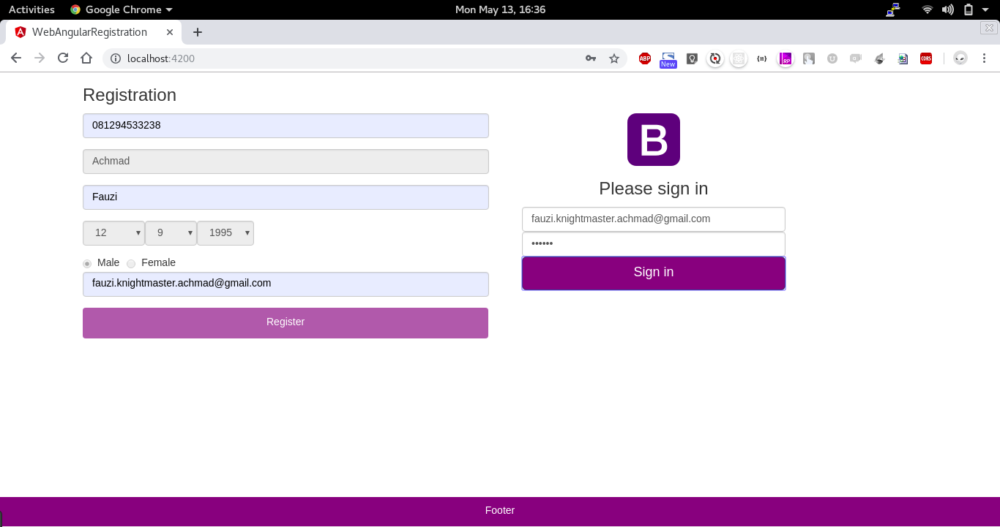
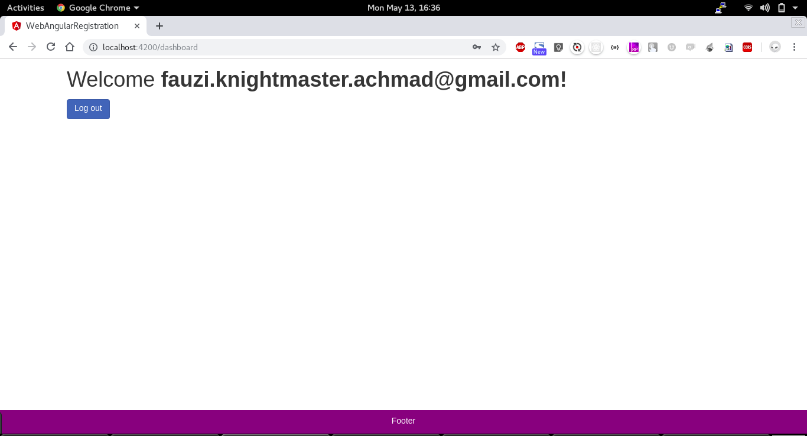
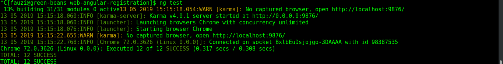
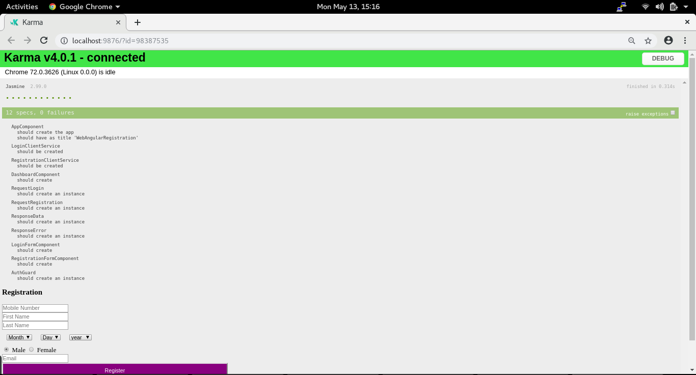
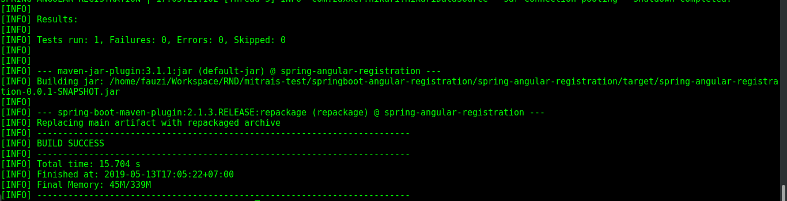

# springboot-angular-registration
A Simple Registration and Login Page using SpringBoot and Angular. This repository contains two project **spring-angular-registration** for backend and **web-angular-registration** for the frontend.

### Technologies !
WEB :
  - Angular 7 CLI
  - Bootstrap
  - Karma
  - Jasmine
  
API :
  - Spring Web
  - Spring Security
  - JPA
  - PostgreSQL
  - Spring Test
  
# Steps to run the project 
  - Create DB and Restore file **schema.sql**
  - Run Backend **spring-angular-registration** and make sure there is no Error
  - Run Frontend **web-angular-registration**
  
# How To Build And Run : spring-angular-registration (backend)
  - Open file : spring-angular-registration/src/main/resources/application.yml
  - Suppose you are running on local environment, change property spring.profiles.active : into local
  - Open file spring-angular-registration/src/main/resources/application-local.yml
  - Change property log.file.path : depend on your local storage
  - Change property db.name, db.host, db.port, db.username, db.password depend on your local configuration
  - Compile : 
```sh
    $ mvn clean package
```  
- or directly Run : 
```sh
    $ mvn spring-boot:run
```  

# How To Build And Run : web-angular-registration (frontend)
  - Install dependencies :
```sh
    $ npm install
```  
  - If everything installed properly , run :
```sh
    $ ng serve
```  
  - Open browser and go to http://localhost:4200
  - port 4200 is default, you can change with command --port to change the port








# How To Run Unit Testing : web-angular-registration (frontend)
  - Run :
```sh
    $ ng test
```  




# How To Run Unit Testing : spring-angular-registration (backend)
  - Run :
```sh
    $ mvn clean package
```



#### *Username for Login is Email and Password is FirstName